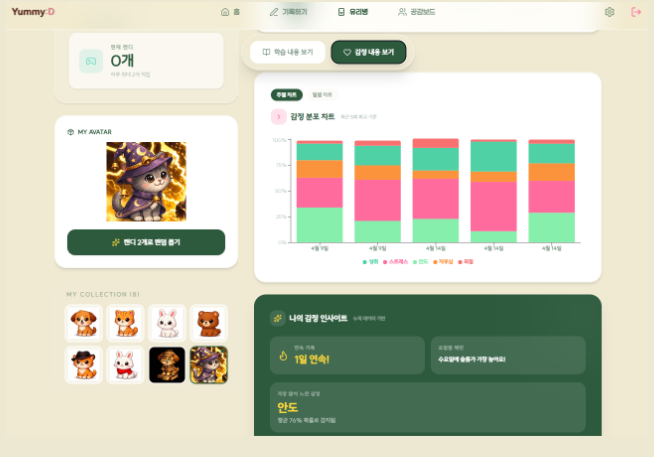
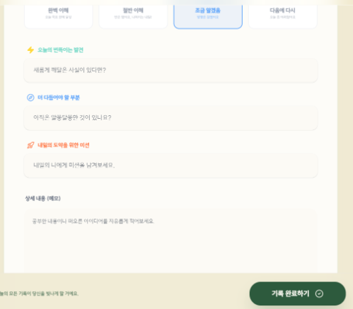
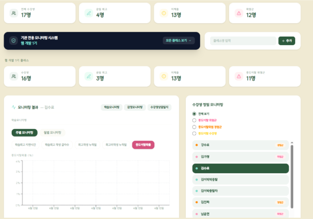
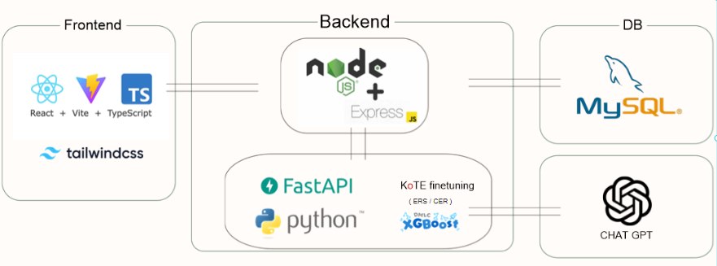

# Yummy:D

<p align="center">
  
</p>
<p align="center">
  LLM 기반 일일 회고로 부트캠프 수강생 감정을 케어하고 중도이탈을 예측하는 B2B 에듀테크 서비스
</p>

---

## 1. 프로젝트 소개

### 프로젝트 개요

Yummy:D는 부트캠프 수강생이 매일 작성하는 감정·학습 회고에서 감정 위험도를 추적해 중도이탈을 조기에 감지하는 서비스입니다. 글로벌 코딩 부트캠프 시장이 빠르게 성장하는 가운데, 고강도 단기 교육 특성상 수강생은 높은 스트레스를 겪지만 정신건강 전문의 1인당 담당 환자 수는 OECD 평균의 3.2배에 달해 조기 개입이 어렵습니다. 직업훈련 수료생의 평균 중도이탈률은 18~25%이고 이탈 사유 1위가 심리적 부담·학습의욕 저하인데도 사후 대응만 가능했던 구조적 한계를, KoTE 기반 감정 분류와 XGBoost 이탈 예측 모델로 조기 감지 체계를 만들어 해결합니다.

### 프로젝트 정보

| 항목      | 내용                        |
| ------- | ------------------------- |
| 프로젝트명   | Yummy:D                    |
| 제작 기간   | 2026.03.23 ~ 2026.04.17 |
| 팀원 수    | 4명 (팀명: 파워코드)             |
| 프로젝트 유형 | 팀 프로젝트 (스마트인재개발원 최우수상 수상 · 2026.04.28) |
| 담당 역할   | 백엔드 감정 추출 API 설계 및 로그인 관리, 아바타 뽑기·실시간 공감 게시판 프론트엔드 구현, AI 모델 검증·튜닝 |

---

## 2. 주요 기능

### 2.1 데일리 리플렉션 + KoTE·XGBoost 감정 위험도 산출

수강생이 감정·학습 회고를 작성하면, HuggingFace `KoTE` 파인튜닝 모델이 13종 감정을 다중 라벨(sigmoid) 확률로 동시 추출합니다. 감정별 가중치를 내적한 감정위험도(ERS)를 구하고, 지수평활 + 연속발생 증폭 페널티를 적용한 누적감정위험도(CER)로 시계열 추이를 반영합니다. 누적 출석·결석일, 회고 지연시간, 글자수, CER 점수 등 6개 피처를 XGBoost에 입력해 중도이탈 확률을 산출합니다.

* 회고 등록 API는 ML 분석(최대 45초)을 기다리지 않고 즉시 응답 후 백그라운드에서 비동기 분석
* Socket.IO로 분석 완료 이벤트를 실시간 전송해 폴링 없이 결과 수신
* GPT-4o-mini가 학습 목표·성취도를 3문장 이내로 자동 요약

**감정 분류 라벨 (13종)**

| 긍정 | 부정 |
| --- | --- |
| 행복 (happy) | 슬픔 (sad) |
| 충만 (fulfill) | 불안 (anxious) |
| 안도 (relief) | 패배감 (defeat) |
| 감사 (gratitude) | 스트레스 (stress) |
| 자부심 (proud) | 당혹감 (embarrassed) |
| | 지루함 (bored) |
| | 탈진 (exhausted) |
| | 우울 (depressed) |

### 2.2 B2B 관리자 대시보드 (조기이탈 위기 감지)

기관·강사가 로그인하면 소속 학생들의 이탈 확률을 집계해 전체 통계, 주간 위험도 추이, 반별 고위험 학생 리스트, 개별 학생 모니터링(회고 지연시간·글자수·결석일수 이력), 상담 메모까지 제공합니다.

* 기관 → 반 → 학생 계층 구조로 위험도 집계
* 이탈 확률 임계값 기준 고위험/주의군 단계 분류 알림

### 2.3 캔디 리워드 & 실시간 공감 게시판

리플렉션 작성으로 얻은 캔디로 확률 기반 뽑기(가중치 랜덤)를 통해 아바타를 수집하는 보상 루프와, Socket.IO room 기반 실시간 익명 게시판("블라블라 캔디")을 제공합니다.

* 캔디 유리병으로 감정 히스토리를 시각적으로 확인
* 게시글 작성/수정/삭제/좋아요, 클래스별 최대 50개 유지

---

## 3. 화면 구성

### 학생 홈 (아바타 · 캔디 · 감정 인사이트)



학생이 로그인하면 보이는 메인 화면입니다. 뽑기로 모은 아바타 컬렉션, 캔디 보유 현황, 기간별 감정 분포 차트, 요일별 감정 흐름·최근 자주 느끼는 감정 등을 요약하는 "나의 감정 인사이트" 카드를 확인할 수 있습니다.

### 일일 회고 작성



학생이 매일 작성하는 감정·학습 회고 입력 화면입니다. 이해도(완벽 이해/헷갈림/조금 알겠음/다음에 다시)를 선택하고, 오늘의 발견·더 다듬어야 할 부분·내일의 미션·상세 메모를 기록하면 KoTE·XGBoost 분석 파이프라인으로 전달됩니다.

### 관리자 대시보드 (기관/강사용)



기관·강사가 보는 모니터링 화면입니다. 전체/반별 수강생 수, 경고·주의·위험군 통계를 상단에서 보여주고, 개별 학생을 선택하면 학습·감정 모니터링 탭에서 주간/월간 이탈 위험도 추이와 상담일지를 확인할 수 있습니다.

---

## 4. 기술 스택

### Language

* JavaScript (백엔드)
* TypeScript (프론트엔드)
* Python (ML 서버)

### Frontend

* React 19.2.4, TypeScript 5.9.3, Vite 8.0.1
* Tailwind CSS 4.2.2 (`@tailwindcss/vite`)
* Zustand 5.0.12 (상태 관리)
* Recharts 3.8.1 (대시보드 차트)
* Framer Motion 12.38.0 (애니메이션)
* socket.io-client 4.8.3

### Backend

* Node.js, Express 5.2.1
* Sequelize 6.37.8 (MySQL ORM) — `sequelize.sync()`로 스키마 자동 동기화
* jsonwebtoken, bcryptjs (인증)
* socket.io 4.8.3 (실시간 캔디보드)

### AI / ML

* FastAPI, PyTorch(CPU), transformers
* KoTE (`searle-j/kote_for_easygoing_people`, 한국어 13종 감정 다중 라벨 분류)
* XGBoost, scikit-learn (중도이탈 확률 예측, 6개 피처)
* OpenAI `gpt-4o-mini` (회고 요약)

### Database

* MySQL + Sequelize ORM (모델 7개)

### Infrastructure

* Docker (서비스별 개별 Dockerfile: backend / frontend / MLServer)
* 프론트엔드 Netlify, 백엔드·ML 서버 Render, 모델 학습 Google Colab

### Development / Collaboration

* GitHub
* Figma (화면 설계)
* Postman (API 테스트)
* DBeaver (DB 관리)

---

## 5. 시스템 아키텍처



React/TypeScript 프론트엔드가 Express 백엔드(포트 5000)에 JWT 인증 REST API로 접근하고, 실시간 채널은 Socket.IO로 별도 유지합니다. 학생이 리플렉션을 제출하면 백엔드는 즉시 DB에 저장 후 응답을 반환하고, 비동기로 FastAPI ML 서버(포트 8000, 타임아웃 45초)에 원본 텍스트·누적 지표·직전 CER 값을 전달합니다. ML 서버는 싱글톤으로 기동 시 KoTE·XGBoost·스케일러를 메모리에 적재해 두고, 요청마다 KoTE 추론 → GPT-4o-mini 요약 → ERS/CER 연산 → XGBoost 추론을 순서대로 실행합니다. 백엔드는 결과를 `Analyses` 테이블에 저장하고 Socket.IO로 사용자 전용 room에 완료 이벤트를 발행합니다.

### 구성 요소

| 구성 요소 | 역할 |
| --- | --- |
| Frontend (React/Vite, TS) | 회고 작성 UI, 캔디 유리병, 실시간 게시판, 관리자 대시보드 |
| Backend (Express, 5000) | 인증, 회고 CRUD, 관리자 API, Socket.IO 이벤트 발행 |
| ML 서버 (FastAPI, 8000) | KoTE 감정 분류, ERS/CER 연산, XGBoost 이탈 예측, GPT 요약 |
| MySQL | 기관·반·학생·회고·분석 결과 저장 |
| OpenAI API | 회고 요약 생성 |

---

## 6. 프로젝트 구조

```text
Project-Yummy-D/
├── yummyd-frontend/       # React + TypeScript SPA
│   ├── public/             # 캐릭터 이미지, 아키텍처 이미지
│   └── src/
│       ├── pages/          # Home, Reflection, Jar, InBoard, StBoard 등
│       ├── components/     # Navbar, YummyCharacter, EmotionBuddies 등
│       └── store/          # Zustand 스토어
├── yummyd-backend/         # Node.js Express API 서버 (5000)
│   ├── routes/              # auth, class, reflection, collection, admin
│   ├── controllers/
│   ├── models/              # Sequelize 모델
│   ├── scripts/              # fix_cumulative_absence_days.js 등 백필 스크립트
│   └── server.js
├── yummyd-MLServer/        # FastAPI ML 분석 서버 (8000)
│   ├── app/
│   │   ├── api/              # /analyze 엔드포인트
│   │   ├── services/         # MLPipelineService (싱글톤)
│   │   └── models/           # Pydantic 스키마
│   └── assets/                # XGBoost 모델 및 스케일러(.pkl)
└── README.md
```

### 주요 디렉토리

| 디렉토리 | 설명 |
| --- | --- |
| `yummyd-backend/controllers` | 회고 등록, 관리자 집계 등 비즈니스 로직 |
| `yummyd-backend/scripts` | 운영 데이터 백필/보정 스크립트 |
| `yummyd-MLServer/app/services` | KoTE·XGBoost·GPT 파이프라인 (싱글톤) |
| `yummyd-MLServer/assets` | 학습된 XGBoost 모델·스케일러 |

---

## 7. 트러블슈팅

<details>
<summary><b>7.1 시간대 오류로 인한 ML 피처 데이터 오염</b> — 중도이탈 예측의 핵심 피처인 누적 결석일이 실제 운영 중 잘못 계산됨</summary>

**Why**
`Date.toISOString()` 등 UTC 기준 날짜 변환을 사용해 한국 새벽 시간대(00:00~09:00 KST)에 작성된 회고가 전날 날짜로 오분류되었고, 결석일 계산 기준점도 실제 수강 시작일이 아닌 첫 회고 제출일로 되어 있어 등록 직후 며칠간의 결석이 통계에서 누락되고 있었습니다.

**Solution**
로컬 날짜 헬퍼(`toLocalDateStr`)를 도입해 UTC 오차를 제거하고, 이미 잘못 적재된 과거 데이터는 백필 스크립트(`fix_cumulative_absence_days.js`)로 전체 학생의 회고 레코드를 순회하며 결석일을 재계산·일괄 업데이트했습니다.

**Result**
신규 데이터는 생성 시점부터 정확한 로컬 날짜 기준으로 계산되고, 기존 운영 데이터도 소급 보정되어 XGBoost 모델에 입력되는 피처의 신뢰도를 확보했습니다.

**Takeaway**
서버 로직에서 날짜·시간은 UTC로 통일해 저장하더라도, 사용자의 하루 단위 행동(출석/결석, 자정 넘김 등)을 판정하는 값은 반드시 사용자의 로컬 타임존 기준으로 계산해야 한다는 것을 배웠습니다.

</details>

<details>
<summary><b>7.2 무거운 AI 추론 파이프라인으로 인한 응답 지연</b> — 회고 제출마다 KoTE·GPT·XGBoost 순차 처리로 수 초 이상 응답이 지연됨</summary>

**Why**
리플렉션 하나를 분석하려면 KoTE 감정 추론 → GPT-4o-mini 요약 → ERS/CER 연산 → XGBoost 추론까지 순차 처리가 필요했습니다. LLM 호출과 트랜스포머 추론은 네트워크 왕복과 모델 연산 시간이 누적되는 I/O·연산 바운드 작업으로, HTTP 요청-응답 사이클 안에서 동기 처리하면 사용자 경험이 크게 저하되는 구조적 한계가 있었습니다.

**Solution**
DB 저장·캔디 지급까지만 처리한 뒤 즉시 응답을 반환하고, 분석 함수를 `await` 없이 백그라운드로 분리했습니다. ML 서버 호출에는 45초 타임아웃을 설정했고, 분석 완료 시 Socket.IO로 사용자 전용 room에 이벤트를 발행했습니다.

**Result**
사용자는 제출 즉시 다음 화면으로 이동할 수 있게 되었고, 무거운 AI 파이프라인은 백그라운드에서 안전하게 처리된 뒤 실시간 이벤트로 결과가 전달되는 구조로 개선되었습니다.

**Takeaway**
무거운 연산(LLM 호출, 모델 추론 등)은 요청-응답 경로에서 분리해 비동기로 처리하고, 완료 시점을 실시간 이벤트로 알리는 패턴이 체감 성능을 크게 개선한다는 것을 배웠습니다.

</details>

<details>
<summary><b>7.3 실시간 게시판의 사용자 식별자 타입 불일치로 인한 좋아요 오작동</b> — 이미 좋아요를 누른 사용자가 다시 눌러도 취소되지 않거나 중복 집계됨</summary>

**Why**
소켓 이벤트로 전달되는 `userId`가 문자열과 숫자로 혼재되어 전달될 수 있었고, 배열 비교(`likedBy.includes(uid)`)가 엄격한 타입 비교를 사용해 `"12" !== 12`로 판정되면서 동일 사용자가 다른 타입으로 요청할 때마다 좋아요가 계속 추가될 수 있었습니다.

**Solution**
수신한 `userId`를 `Number()`로 정규화하고, 비교 대상인 `likedBy` 배열 전체도 `.map(Number)`로 일괄 변환한 뒤 비교하도록 수정했습니다.

**Result**
좋아요 토글이 사용자 1인당 정확히 한 번만 반영되도록 보장되어 게시판 데이터의 무결성을 확보했습니다.

**Takeaway**
느슨한 타입의 언어(JavaScript)에서 배열 포함 여부나 동등 비교를 할 때는 타입을 명시적으로 정규화한 뒤 비교해야 한다는 것을 배웠습니다.

</details>

---

## 8. 실행 방법

### 요구 사항

* Node.js
* Python (FastAPI ML 서버)
* MySQL 인스턴스

### 설치 및 실행 — 프론트엔드

```bash
cd yummyd-frontend
npm install
npm run dev
```

### 설치 및 실행 — 백엔드

```bash
cd yummyd-backend
npm install
npm run dev               # http://localhost:5000
```

`yummyd-backend/.env`

```env
DB_HOST=
DB_PORT=3306
DB_USER=
DB_PASSWORD=
DB_NAME=
JWT_SECRET=
ML_SERVER_URL=http://localhost:8000
```

### 설치 및 실행 — ML 서버

```bash
cd yummyd-MLServer
pip install -r requirements.txt
uvicorn app.main:app --reload --port 8000
```

`yummyd-MLServer/.env`

```env
HF_TOKEN=        # Hugging Face 토큰 (KoTE 모델 다운로드용)
OPENAI_API_KEY=
```

---

## 9. 배포

### 배포 환경

* 프론트엔드: Netlify
* 백엔드 / ML 서버: Render
* 모델 학습: Google Colab
* Docker (서비스별 개별 Dockerfile)

### 배포 구조

세 서비스가 독립적으로 배포되며, 프론트엔드는 Netlify 정적 호스팅, 백엔드와 ML 서버는 Render에서 각각 컨테이너로 실행됩니다.

---

## 10. 관련 문서

기획 문서, 발표 자료, API 명세서: [Google Drive](https://drive.google.com/drive/folders/1f_e1wTXH2Urpon0Q3-Z_27Nu9NuJB7_F?usp=drive_link)

---

## 11. 회고 및 성과

### 담당 업무

* 백엔드 감정 추출 API 설계 및 연동, 로그인 관리(해싱), Socket.IO 클라이언트 연동
* 프론트엔드 아바타 뽑기 기능 구현, 실시간 공감 게시판 UI 구현
* 감정 분류 모델 검증(임계값 측정) 및 모델 성능 튜닝

### 주요 성과

* 13종 감정 다중 라벨 동시 추적 (한국어 특화 KoTE 모델)
* 회고 제출 후 45초 이내 분석 완료, 제출 즉시 응답으로 체감 지연 없음
* 6개 피처 기반 XGBoost로 이탈 확률 예측 파이프라인 구축

### 기술적으로 해결한 문제

* 위 트러블슈팅 7.1~7.3 참고

### 프로젝트를 통해 배운 점

날짜·시간 계산은 저장 시점의 UTC 통일과 별개로, 사용자 행동을 판정하는 로직은 반드시 로컬 타임존 기준으로 다시 검증해야 한다는 것을 배웠습니다. 또한 LLM 호출·모델 추론처럼 무거운 연산은 요청-응답 경로에서 분리해 비동기로 처리하고 완료 시점을 실시간 이벤트로 알리는 패턴이 체감 성능에 큰 영향을 준다는 것, 그리고 느슨한 타입의 언어에서는 값 비교 전에 타입을 명시적으로 정규화해야 한다는 것을 실무 버그를 통해 체감했습니다.

### 개선할 점

* ML 서버의 위험 판정 임계값(`is_danger`, `dropout_prob > 0.65`)과 관리자 대시보드의 고위험 기준(`dropout_prob >= 0.99`)이 이원화되어 있어, 단일 설정값으로 통합할 필요가 있습니다.
